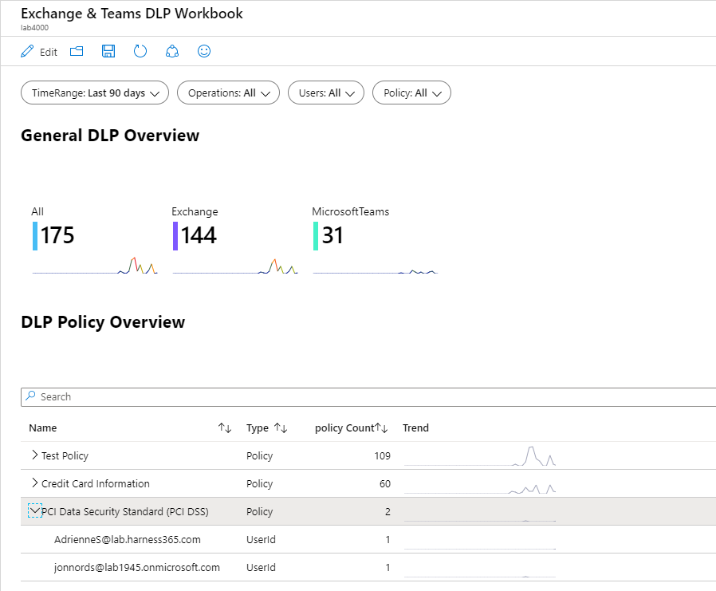
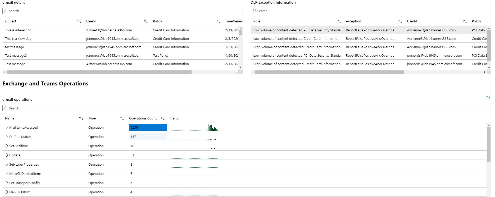
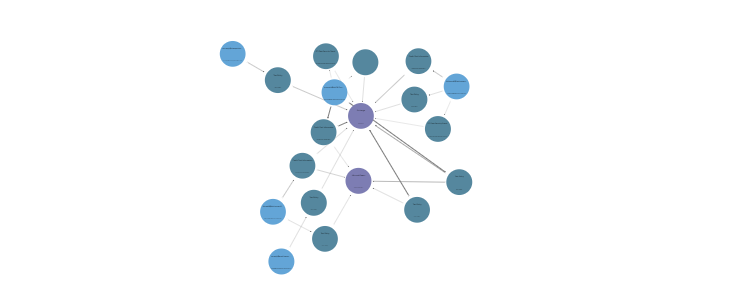

# Until we have published the Workbooks to the official GitHub for Sentinel

## Workbooks - how to Import and Export:

Please follow the instruction below to setup the workbooks in your environment. There is one Workbook for Exchange & Teams,
a separate workbook for OneDrive and SharePoint.

### Installation Instructions:
 
1. [Open] Workbooks from the Sentinel Workspace where you intend to install the workbooks / portal.azure.com
2. [Click] "Add workbook" 
3. When the New Workbook window open select edit, then select the Advanced Editor ([click] the </> icon )
4. Copy the text of the json template you are installing from this repository [paste] over any json that exists.
5. [Click] save, select the appropriate location and name for the workbook.

### The report will look something like this.
The first section provides a view of the number of DLP incidents per workload. It also allows for quickly viewing the users that have breached certain Policies. If a user is selected it will filter the rest of the screen.

The next portion provides a view over time and the specific rules that triggered the DLP Policy. There is also a list over the policies where users have requested an exception to the rule.

The last section of this report provides some details to DLP exceptions as well as the details on the e-mails. Right now we are only adding subject to the emails triggering the alert.

