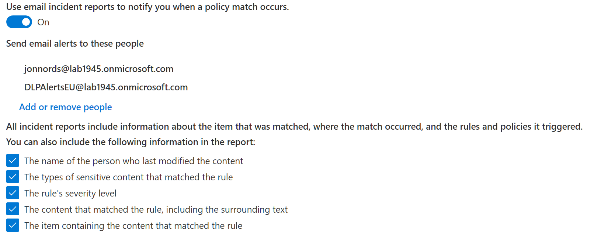

# Copy Original Message from Incident Mailbox to SharePoint Site
If you have more than one workspace and Geo, you will have to set this up separately if there is a requirement to keep information in Geo at rest.

## Prerequisites
- Complete the steps to setup the ActualID function as part of the main package

## Setup

1. Ensure to setup your DLP rule to forward the full details of incidents to the mailbox used for extraction by the function. For this sample we are using DLPAlertsEU.

2. Create a SharePoint Site Collection in Region with the appropriate retention time. Use a Records center template if you need to treat the information as records. See the SharePoint Online limits to determine if you need more than one collection per region. This will depend on your expected load and retention period. You can change the ingestion code to ingest information based on the Policy Name as an example to scale this out.

3. [Click] Deploy to Azure above

4. Provide the right Resource Group, where the function app resides. You can move the function later. Provide the function app name used for ActualID (Name of the function created in the first step). If you want to change the Workflow name do so from here. Don't touch the connections for SharePoint and Exchange they can be changed later.

5. When deployed change the connections used for when email arrives and for Export email as well as for SharePoint.

### More information
The information transferred to the ActualID function from the Logic App is limited to the Body preview. It doesn't contain sensitive information. 
 
{
  "emailbody": "A match of one or more of your organization’s policy rules has been detected.\r\n\r\nService: Exchange\r\nMatched item: <MN2PR00MB0558C378837405EE8C28F45C871D0@MN2PR00MB0558.namprd00.prod.outlook.com>\r\nTitle: Person\r\nDocument owner:\r\nPerson who last modified do"
}
